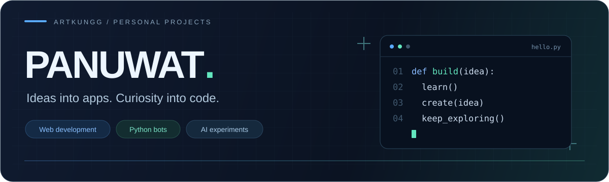
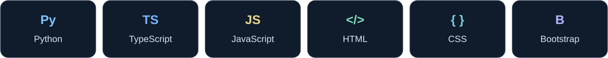
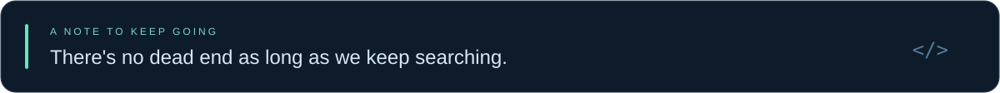

  

  <b>Hi, I'm Panuwat Watjara.</b> 
  A web developer exploring apps, automation, and AI through personal projects.

  <a href="#my-toolbox">My toolbox</a> &nbsp; / &nbsp;
  <a href="https://github.com/ArtKunggg?tab=repositories">All repositories</a>

 

### My toolbox

Languages and tools across my web, app, and bot projects.

  

 

  

