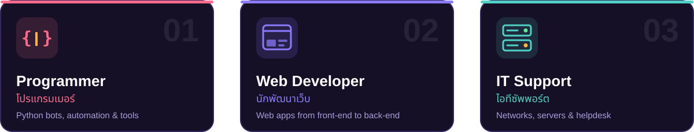

  

  
  
  
  

 

## 👋 About me · เกี่ยวกับผม

**English**

Hi! I'm **Panuwat Watjara**, but everyone calls me **Art**. I work as a **programmer**, **web developer** and **IT support**. I enjoy building tools that make everyday work easier, from web and mobile apps to Discord bots and small AI experiments.

**ภาษาไทย**

สวัสดีครับ ผมชื่อ **ภานุวัตน์ วัจรา** ชื่อเล่น **อาร์ท** ทำงานสาย **โปรแกรมเมอร์** **นักพัฒนาเว็บ** และ **ไอทีซัพพอร์ต** ชอบสร้างเครื่องมือที่ช่วยให้งานประจำวันง่ายขึ้น ตั้งแต่เว็บแอป แอปมือถือ ไปจนถึงบอท Discord และการทดลองเล่นกับ AI

- 🔭 Building web & mobile apps · กำลังพัฒนาเว็บและแอปมือถือ
- 🤖 Discord bots & local AI · บอท Discord และ AI บนเครื่องตัวเอง
- 🛠️ Keeping networks & servers running · ดูแลระบบเครือข่ายและเซิร์ฟเวอร์
- 🌱 Always learning something new · เรียนรู้สิ่งใหม่อยู่เสมอ

 

## 🧭 What I do · สิ่งที่ผมทำ

  

## 🧰 Tech stack · เครื่องมือที่ใช้

  <b>Languages · ภาษา</b>  
  

  <b>Frameworks & tools · เฟรมเวิร์กและเครื่องมือ</b>  
  

  <b>Systems · ระบบ</b>  
  

  <b>AI tools · เครื่องมือ AI</b>  
  
  
  

## 🚀 Projects · ผลงาน

| Project | About · รายละเอียด | Stack |
| --- | --- | --- |
| [**WachiApp**](https://github.com/ArtKunggg/MobileApp) | Mobile app for the Wachi System · แอปมือถือสำหรับระบบ Wachi | TypeScript |
| [**BotSteamSale**](https://github.com/ArtKunggg/BotSteamSale) | Discord bot that posts Steam deals · บอท Discord แจ้งเกมลดราคาบน Steam | Python |
| [**BotMusicDiscord**](https://github.com/ArtKunggg/BotMusicDiscord) | Music bot for Discord · บอทเปิดเพลงใน Discord | Python |
| [**Bot_Ollama**](https://github.com/ArtKunggg/Bot_Ollama) | Q&A bot on a local LLM with Ollama *(in progress)* · บอทถามตอบด้วย AI *(กำลังพัฒนา)* | Python |
| [**WebScraping**](https://github.com/ArtKunggg/WebScraping) | Pulling data from websites · ดึงข้อมูลจากเว็บไซต์ | Python, HTML |

## 🐍 Contributions · การมีส่วนร่วม

  <picture>
    <source media="(prefers-color-scheme: dark)" srcset="https://raw.githubusercontent.com/ArtKunggg/ArtKunggg/output/github-snake-dark.svg" />
    <source media="(prefers-color-scheme: light)" srcset="https://raw.githubusercontent.com/ArtKunggg/ArtKunggg/output/github-snake.svg" />
    
  </picture>

 

  

